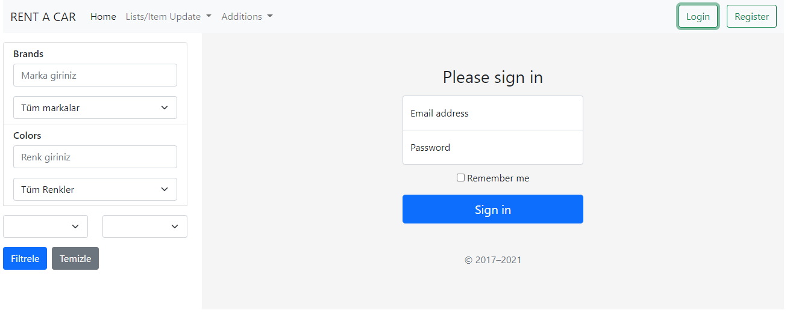

[![LinkedIn][linkedin-shield]][linkedin-url]

# Rentacar
>
This project was generated with [Angular CLI](https://github.com/angular/angular-cli) version 11.2.4. This is an example of rent a car system for todays online websites. Aim of this project is improving my skills and learn new design patterns.

## Table of contents
* [General info](#general-info)
* [Technologies](#technologies)
* [Features](#features)
* [Development Server](#development-server)
* [Further Help](#further-help)
* [Screenshots](#screenshots)
* [Status](#status)
* [Inspiration](#inspiration)
* [Contact](#contact)

## Technologies
* Angular
* [.NET](https://github.com/bekozdemir/ReCapProject)

## Features
List of features ready 
* Login/Register
* Car/Brand/Color Add/Update
* Car/Brand/Color filter options
* Looking details of cars
* Creating rental

## Development server

Run `ng serve` for a dev server. Navigate to `http://localhost:4200/`. The app will automatically reload if you change any of the source files.

## Further help

To get more help on the Angular CLI use `ng help` or go check out the [Angular CLI Overview and Command Reference](https://angular.io/cli) page.

## Screenshots

## Status
Project status: _struggling wtih some bugs and still developing the project_

## Inspiration
This project started to develop paralel with [Engin DEMİROG](https://github.com/engindemirog)'s online developers education camp. I need to thank to engindemirog for his great online course and big heart. Also, I need to thank to this community who helped me with the questions and bugs.

[kodlama.io](https://www.kodlama.io/)

## Contact
Created by [@bekozdemir](https://github.com/bekozdemir/) - feel free to contact with me!

[linkedin-shield]: https://img.shields.io/badge/LinkedIn-0077B5?style=for-the-badge&logo=linkedin&logoColor=white
[linkedin-url]: https://www.linkedin.com/in/berkay-özdemir/
